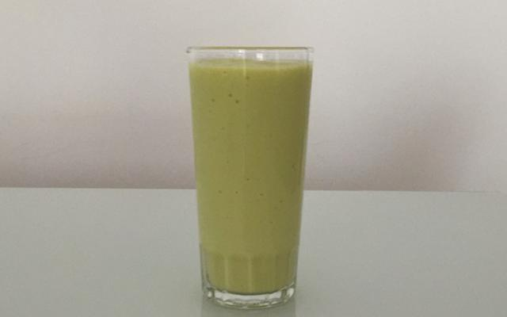

# ***Abacatada***
___

___

## **Ingredientes**

- 1 abacate bem grande
- 1 litro de leite
- 2 colheres de açúcar ou a gosto
___

## **Utensílios**

- Copo
- Liquidificador
- Faca
- Tábua de corte
___

## **Modo de Preparo**
1. Descasque o abacate, tire o caroço.
2. Coloque todos os ingredientes no liquidificador, bata e está pronto para servir.
___

# Tempo estimado: 2 minutos
