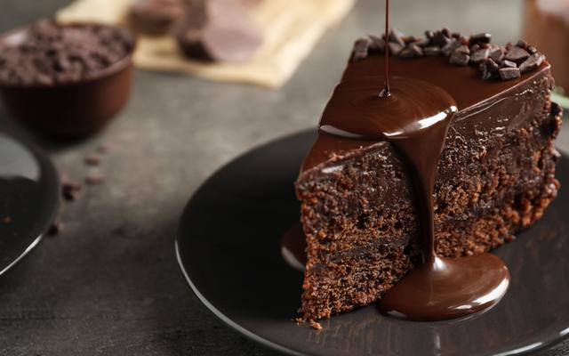

# ***Bolo De Chocolate***
___

___

## **Ingredientes**

### Massa

- 3 ovos
- 2 xícaras (chá) de farinha de trigo
- 1/2 xícara (chá) de óleo
- 1 pitada de sal
- 1 e 1/2 xícara (chá) de açúcar
- 1 xícara (chá) de chocolate em pó ou achocolatado
- 1 colher (sopa) de fermento em pó
- 1 xícara (chá) de água quente

### Cobertura

- 4 colheres (sopa) de leite
- 1 colher (sopa) de manteiga
- 1/2 xícara (chá) de chocolate em pó
- 1 xícara (chá) de açúcar

### Utensílios

- Liquidificador
- Panela
- Forma de bolo
- Bowl
___
## **Modo de Preparo**
- Massa

  1. Em um liquidificador, bata os ovos, o açúcar, o óleo, o achocolatado e a farinha de trigo.
  2. Despeje a massa em uma tigela e adicione a água quente e o fermento, misturando bem.
  3. Despeje a massa em uma forma untada e asse em forno médio-alto (200° C), preaquecido, por 40 minutos.
  4. Desenforme ainda quente.

- Cobertura

  1. Em uma panela, leve todos os ingredientes ao fogo até levantar fervura.
  2. Despeje ainda quente em cima do bolo.
___

# Tempo estimado: 50 minutos