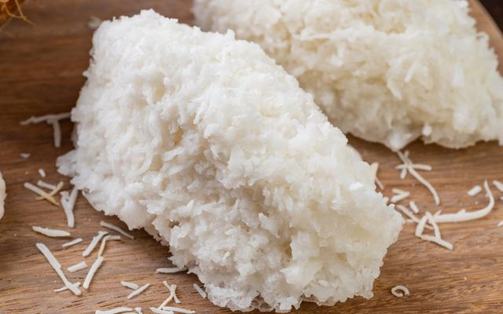

# ***Cocada***
___

___

## **Ingredientes**

- 400 g de coco fresco ralado
- 1 e 1/2 xícara (chá) de água
- Óleo, o quanto baste para untar
- 2 e 1/2 xícaras (chá) de açúcar
- 1/4 xícara (chá) de leite condensado

___

## **Utensílios**

- Panela
- Colher de madeira
- Forma

___

## **Modo de Preparo**

1. Unte uma assadeira grande com óleo.
2. Reserve.
3. Coloque a água e o açúcar numa panela e leve ao fogo alto.
4. Deixe a calda cozinhar até o ponto de fio médio.
5. Despeje o coco na panela com a calda e mexa.
6. Acrescente o leite condensado e continue mexendo até que comece a desprender do fundo da panela.
7. Retire a cocada do fogo e coloque as colheradas sobre a assadeira untada.
8. Espere endurecer um pouco e retire as cocadas da assadeira com uma espátula.
9. Se quiser guardar a cocada, deixe esfriar bem e guarde num recipiente com tampa.

___

# Tempo estimado: 30 minutos
