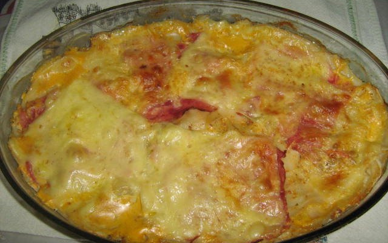

# ***Lasanha Mista***
___

___

## **Ingredientes**

- 1 pacote de massa para lasanha
- 150g de presunto
- 1 caixinha de creme de leite
- 1 pacote de queijo ralado
- 100 g de carne moída
- 4 tomates cortados em cubo
- 1 caldo de carne
- 150g de queijo
- 1 colher de sopa de farinha de trigo
- 100 ml de leite
- 2 colheres de manteiga
- 1 cebola picadinha
- 1 caixinha de polpa de tomate
- Sal e açúcar a gosto

___
## **Modo de Preparo**

1. Cozinhe a massa de lasanha em água, sal e óleo.

- Molho Bolonhesa

  1. Coloque a cebola picadinha em 1 colher de sopa de manteiga, refogue e acrescente a carne moída, continue refogando e acrescente alho, sal, caldo de carne picadinho, e continue mexendo.
  2. Acrescente a polpa de tomate e deixe refogar.
  3. No liquidificador bata os 4 tomates com o restante da polpa de tomate, depois na panela da carne moída deseje todo o líquido batido no liquidificador.
  4. Tempere com uma pitada de sal e outra de açúcar.
  5. Deixe ferver, desligue e coloque 1/2 caixinha de creme de leite.

- Molho Branco
  1. Em uma panela coloque uma colher de sopa de margarina, cebola picadinha, refogue e acrescente a farinha de trigo, deixe torrar um pouquinho e dissolva as bolinhas no leite.
  2. Deixe ferver e fazer um mingau, acrescente o queijo ralado e 1/2 caixinha de creme de leite.

- Montagem
  1. Coloque o molho bolonhesa, presunto, massa, molho branco, queijo alternadamente, sendo a última camada de queijo.
___

# Tempo estimado: 30 minutos
