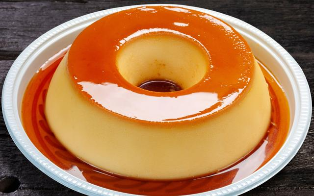

# ***Pudim***
___

___

## **Ingredientes**

- 1 lata de leite condensado
- 1 lata de leite (medida da lata de leite condensado)
- 3 ovos

### Calda

- 1 xícara (chá) de açúcar
- 1/2 xícara de água

### Utensílios

- Liquidificador
- Panela
- Forma de pudim
- Prato de sobremesa
- Espátula

___
## **Modo de Preparo**
- Pudim - part 1

  1. Primeiro, bata bem os ovos no liquidificador.
  2. Acrescente o leite condensado e o leite, e bata novamente.
  
- Calda

  1. Derreta o açúcar na panela até ficar moreno, acrescente a água e deixe engrossar.

- Pudim - part 2

  3. Coloque em uma forma redonda e despeje a massa do pudim por cima.
  4. Asse em forno médio por 45 minutos, com a assadeira redonda dentro de uma maior com água.
  5. Espete um garfo para ver se está bem assado.
  6. Deixe esfriar e desenforme.

___

# Tempo estimado: 1 hora e 5 minutos